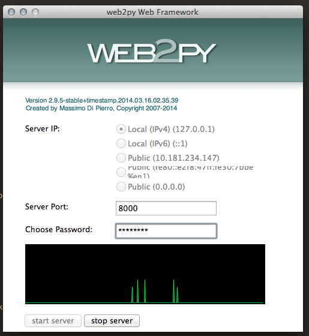

# Treinamento web2py

## Aula 1 (18/03/14)

### 1. Introdução
- Desenvolvido pelo professor Massimo di Pierro com o objetivo de ensinar programação para estudantes universitários
- Framework MVC com o objetivo de ser fácil de desenvolver e manter

#### 1.1. Requisitos

- Python 2.7.x
- Web2Py
- Git

#### 1.2. Ferramentas adicionais

- PyCharm
- PostgreSQL ou MySQL

### 2. Sobre o framework

- O web2py contém toda a estrutura de servidor para a aplicação funcionar
- Possui uma interface gráfica para gerenciamento das aplicações
- Utiliza, como todos os frameworks modernos, o padrão MVC

### 2.1. Área administrativa

O web2py possui uma interface para administrar as aplicações. após instalar o framework, basta executar o comando

--------------------------------------
python web2py.py
--------------------------------------

Na pasta raíz da aplicação para abrir a tela de configuração do servidor do framework.

Após este procedimento, o servidor do framework será iniciado automaticamente e uma página de "Welcome" será aberta no seu navegador.