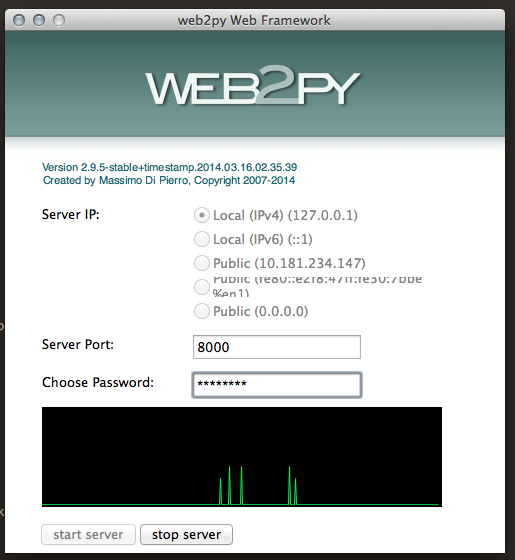

# Treinamento web2py

## Aula 1 (18/03/14)

### Objetivos da aula

- Instalação dos programas necessários
- Demonstrar a facilidade e potencial do framework

### 1. Introdução
- Desenvolvido pelo professor Massimo di Pierro com o objetivo de ensinar programação para estudantes universitários
- Framework MVC com o objetivo de ser fácil de desenvolver e manter

#### 1.1. Requisitos

- Python 2.7.x
- Web2Py

#### 1.2. Ferramentas adicionais

- PyCharm
- PostgreSQL ou MySQL
- Git

### 2. Sobre o framework

- O web2py contém toda a estrutura de servidor para a aplicação funcionar
- Possui uma interface gráfica para gerenciamento das aplicações

### 3. Download da aplicação

#### 3.1. Pelo site oficial
Acesse a [página de downloads](http://www.web2py.com/init/default/download) e selecione a versão compatível com o seu sistema operacional.

#### 3.2. Pelo GitHub
Execute o comando abaixo
```
 git clone https://github.com/web2py/web2py.git
 ```

### 4. Executando o web2py
Para executar o web2py, vá até a pasta onde você salvou o framework e execute o arquivo web2py.py

#### 4.1 Pelo terminal
Caso esteja utilizando o Terminal, execute
```python
 python web2py.py
 ```

Irá surgir a tela de inicialização do web server nativo do framework. Basta adicionar uma senha e clicar em start.

 

Após este procedimento, o servidor do framework será iniciado automaticamente e uma página de "Welcome" será aberta no seu navegador.

#### 4.2 Pelo Pycharm

Para executar o web2py pelo Pycharm é necessário fazer uma configuração inicial.

O caminho mais fácil é:
- 1. Abra o arquivo db.py
- 2. Vá ao menu 'Run' -> 'Run db.py'. Na primeira vez vai dar um erro.
- 3. Volte ao menu 'Run' mas desta vez vá em 'Edit configurations'.
- 4. No lado esquerdo, selecione 'db'.
- 5. No lado direito, altere a primeira linha 'Script', selecionando o arquivo web2py.py no diretorio web2py, Ex: 'c:\dev\web2py\web2py.py'
- 6. Ao executar 'Run' novamente no projeto, irá inicar o web2py.

### 5. Adicionando uma nova aplicação

#### 5.1 Pela interface do Web2py
Na página inicial do web2py, clique em "Administrative Interface". Será socilitada a senha definida anteriormente.

Na tela seguinte, procure "New simple application". Dê um nome e clique em "Create". Uma nova aplicação irá aparecer na lista de aplicações disponíveis.

#### 5.2 Copiando o diretorio

No web2py, uma nova aplicação é uma cópia da aplicação welcome para dentro do diretório applications . Copiando e renomeando a aplicação welcome ou outra aplicação existente, o web2py automaticamente reconhece a nova aplicação.

#### 5.3 Utilizando o Wizard

Utilizando a 'Administrative Interface', é possível criar uma nova aplicação, escolhendo layout, criando novas tabelas e campos, páginas, conteúdo das paginas. O wizard inclusive cria páginas para o gerenciamento de cada tabela.


### 6. Desenvolvendo a aplicação
Agora iremos trabalhar com o código da aplicação. Abra a IDE ou o editor de texto de sua preferência (no caso do curso, utilizamos o PyCharm) e adicione um novo projeto. Vá até a raíz do framework, procure a pasta applications/nome-da-aplicação.

### 7. Criando uma nova tabela no banco de dados
O primeiro passo que iremos realizar é criar uma tabela produto no nosso banco de dados. Para isto, vá em models/db.py e adicione no fim do código as seguintes linhas:

```python
db.define_table('produto',
    Field('nome'),
    Field('preco', 'double'),
    Field('quantidade', 'double')
)
 ```
 As linhas acima criam uma tabela de Produto, com as colunas nome, preço e quantidade.

 ### 8. Adicionando a tabela de produtos na página inicial
 Para adicionar uma tabela com os produtos na tela inicial, vá até  controllers/default.py e substitua a função index() por:

```python
 def index():
    form = SQLFORM.grid(db.produto, user_signature=False)
    return dict(form=form)
```

Agora vá até a raíz da sua aplicação (endereço http://127.0.0.1/nome-aplicacao). Lá agora terá uma lista de produtos vazia e uma opção de adicionar produtos.
